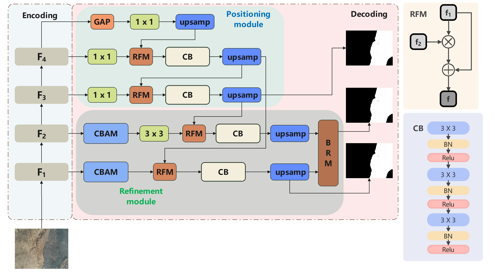

## [BASNet: Burned Area Segmentation Network for Real-Time Detection of Damage Maps in Remote Sensing Images](https://ieeexplore.ieee.org/document/9852471)

By  Weihao Bo, Jie Liu, Xijian Fan, Tardi Tjahjadi, Qiaolin Ye, Liyong Fu

The PyTorch code for IEEE TGRS paper "BASNet: Burned Area Segmentation Network for Real-Time Detection of Damage Maps in Remote Sensing Images"

## Introduction

### BASNet framework



## Usage

### 1. Clone the resposity

```bash

```

### 2. Install Requirements

```
Python 3.6
Pytorch 1.4+
OpenCV 4.0
Numpy
TensorboardX
Apex
```

### 3. Datasets

## Citation

If you find this work is helpful in your research, please cite:

```
@ARTICLE{9852471,
  author={Bo, Weihao and Liu, Jie and Fan, Xijian and Tjahjadi, Tardi and Ye, Qiaolin and Fu, Liyong},
  journal={IEEE Transactions on Geoscience and Remote Sensing}, 
  title={BASNet: Burned Area Segmentation Network for Real-Time Detection of Damage Maps in Remote Sensing Images}, 
  year={2022},
  volume={60},
  number={},
  pages={1-13},
  doi={10.1109/TGRS.2022.3197647}}
```